# دليل تعلم React من خلال مشروع إدارة المشاريع

> **الجمهور المستهدف:** مبتدئ يريد فهم أساسيات البرمجة و React والتطوير على هذا المشروع خطوة بخطوة.  
> **المشروع:** Projects System Management — تطبيق ويب لإدارة المصانع والمشاريع والحسابات.  
> **التقنيات:** Vite · React 19 · TypeScript · Tailwind CSS v4 · React Router · Supabase · TanStack Query

---

## جدول المحتويات

| الحلقة                                             | الموضوع               | المستوى       |
| -------------------------------------------------- | --------------------- | ------------- |
| [0](#الحلقة-0-خريطة-التعلم-والبيئة)                | خريطة التعلم والبيئة  | مقدمة         |
| [1](#الحلقة-1-أساسيات-البرمجة-التي-تحتاجها)        | أساسيات البرمجة       | مبتدئ         |
| [2](#الحلقة-2-ما-هو-react-ولماذا-نستخدمه)          | ما هو React؟          | مبتدئ         |
| [3](#الحلقة-3-هيكل-المشروع-والأدوات)               | هيكل المشروع والأدوات | مبتدئ         |
| [4](#الحلقة-4-نقطة-الدخول-وشجرة-المزودين)          | نقطة الدخول والمزودون | مبتدئ → متوسط |
| [5](#الحلقة-5-التوجيه-والحماية-حسب-الدور)          | التوجيه والصلاحيات    | متوسط         |
| [6](#الحلقة-6-المصادقة-والسياق-context)            | المصادقة والسياق      | متوسط         |
| [7](#الحلقة-7-جلب-البيانات-وإدارة-الحالة-الخادمية) | جلب البيانات          | متوسط         |
| [8](#الحلقة-8-النماذج-والتحقق)                     | النماذج والتحقق       | متوسط         |
| [9](#الحلقة-9-واجهة-المستخدم-والتصميم)             | واجهة المستخدم        | متوسط         |
| [10](#الحلقة-10-الترجمة-والاتجاه-rtl)              | الترجمة و RTL         | متوسط         |
| [11](#الحلقة-11-معالجة-الأخطاء-والتحديث-الفوري)    | الأخطاء والـ Realtime | متقدم         |
| [12](#الحلقة-12-إضافة-ميزة-جديدة-من-الصفر)         | إضافة ميزة جديدة      | متقدم         |
| [13](#الحلقة-13-أفضل-الممارسات-وقرارات-التصميم)    | أفضل الممارسات        | احترافي       |

---

## الحلقة 0: خريطة التعلم والبيئة

### ماذا ستتعلم؟

هذا الدليل مُصمَّم كسلسلة فيديوهات متصلة: كل حلقة تبني على السابقة، وتستخدم **كوداً حقيقياً** من المشروع — لا أمثلة نظرية منفصلة.

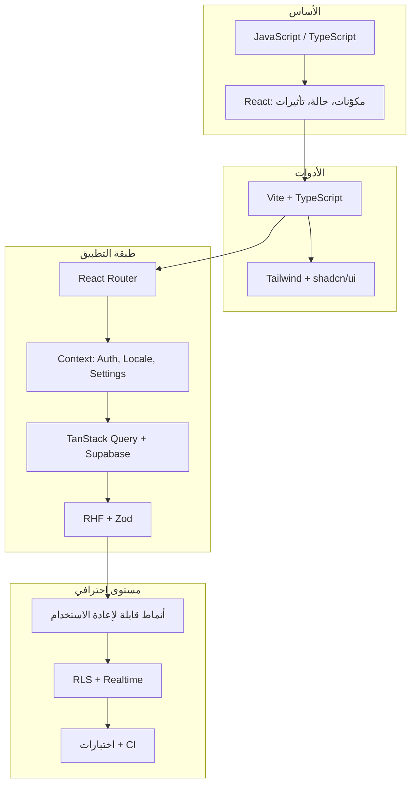

### تشغيل المشروع محلياً

```bash
# تثبيت الاعتماديات
npm install

# تشغيل Supabase محلياً (يتطلب Docker)
npm run supabase:start

# تشغيل واجهة التطوير
npm run dev:local
# أو معاً: npm run start:local
```

| الأمر                    | الغرض                                           |
| ------------------------ | ----------------------------------------------- |
| `npm run dev`            | خادم Vite على `http://localhost:5173`           |
| `npm run verify`         | فحص TypeScript + ESLint                         |
| `npm run build`          | بناء الإنتاج                                    |
| `npm run test`           | تشغيل اختبارات Vitest                           |
| `npm run supabase:reset` | إعادة تهيئة قاعدة البيانات + البيانات التجريبية |

### متغيرات البيئة

التطبيق يقرأ Supabase من ملفات `.env.development` / `.env.staging` / `.env.production`:

```
VITE_SUPABASE_URL=...
VITE_SUPABASE_PUBLISHABLE_KEY=...
```

> **قرار أمني:** الواجهة الأمامية تستخدم **مفتاح publishable فقط** — أبداً مفتاح service-role. الحماية الحقيقية تتم عبر **Row Level Security (RLS)** في PostgreSQL.

---

## الحلقة 1: أساسيات البرمجة التي تحتاجها

قبل React، يجب أن تفهم هذه المفاهيم — ستراها في كل ملف تقريباً.

### 1.1 المتغيرات والأنواع (TypeScript)

المشروع يستخدم **TypeScript** وليس JavaScript العادي. الفرق الأساسي: تحديد أنواع البيانات مسبقاً.

```typescript
// src/types/database.ts — أنواع مُولَّدة من مخطط قاعدة البيانات
export type UserRole =
  'company_director' | 'factory_manager' | 'project_manager'

export type ProjectStatus =
  | 'draft'
  | 'proposed'
  | 'approved'
  | 'rejected'
  | 'in_progress'
  | 'completed'
  | 'paused'
```

**لماذا TypeScript؟**

- يكتشف الأخطاء أثناء الكتابة (قبل التشغيل).
- يُمكّن IDE من الإكمال التلقائي.
- يوثّق العقد بين الواجهة وقاعدة البيانات.

| الخيار     | المزايا                | العيوب            | متى تختاره                            |
| ---------- | ---------------------- | ----------------- | ------------------------------------- |
| JavaScript | أسرع للبدء             | أخطاء وقت التشغيل | نماذج أولية صغيرة                     |
| TypeScript | أمان أنواع، صيانة أسهل | منحنى تعلم        | مشاريع فريق / إنتاج ← **هذا المشروع** |

### 1.2 الدوال غير المتزامنة (async/await)

جلب البيانات من Supabase عملية **غير متزامنة** — لا تنتظر النتيجة فوراً.

```typescript
// src/contexts/AuthContext.tsx
async function fetchProfile(userId: string): Promise<Profile | null> {
  const supabase = getSupabase()
  const { data, error } = await supabase
    .from('profiles')
    .select('*')
    .eq('id', userId)
    .maybeSingle()

  if (error) {
    throw error
  }

  return data
}
```

**القاعدة:** `await` داخل `async` — ودائماً تعامل مع `error`.

### 1.3 الاستيراد والتصدير (Modules)

```typescript
// استيراد من مسار مختصر @/ = src/
import { getSupabase } from '@/lib/supabase'
import type { Profile } from '@/types/database'
```

الاختصار `@/` مُعرَّف في `vite.config.ts`:

```typescript
resolve: {
  alias: {
    '@': path.resolve(rootDir, './src'),
  },
},
```

### 1.4 Destructuring والـ Spread

```typescript
// src/hooks/useProjects.ts — دمج قيم النموذج مع حقول إضافية
.insert({
  factory_id: factoryId,
  ...toProjectPayload(values),  // spread
  status,
  proposed_by: status === 'proposed' ? userId : null,
})
```

---

## الحلقة 2: ما هو React؟ ولماذا نستخدمه؟

### 2.1 الفكرة الأساسية: المكوّنات (Components)

React يقسّم الواجهة إلى **مكوّنات** قابلة لإعادة الاستخدام. كل مكوّن دالة تُرجع وصفاً لما يجب عرضه (JSX).

```tsx
// src/components/QueryState.tsx — مكوّن يعرض حالات التحميل / الخطأ / النجاح
export function QueryState({
  isLoading,
  error,
  loadingMessage,
  errorMessage,
  onRetry,
  children,
}: QueryStateProps) {
  if (isLoading) {
    return <QueryStateSkeleton />
  }

  if (error) {
    return (
      <div>
        <StatusMessage variant="error">{errorMessage}</StatusMessage>
        {onRetry ? <Button onClick={onRetry}>إعادة المحاولة</Button> : null}
      </div>
    )
  }

  return <div className="motion-fade-in">{children}</div>
}
```

**الفكرة:** بدلاً من التلاعب المباشر بـ DOM (`document.getElementById`)، تصف _ماذا_ تريد أن ترى، وReact يحدّث الصفحة.

### 2.2 الحالة (State) وإعادة الرسم

عندما تتغير `state`، React يُعيد رسم المكوّن.

```tsx
// src/pages/LoginPage.tsx
const [isSubmitting, setIsSubmitting] = useState(false)

const onSubmit = form.handleSubmit(async (values) => {
  setIsSubmitting(true)
  try {
    await signIn(values.email, values.password)
    toast.success(t('auth.signedInSuccess'))
  } finally {
    setIsSubmitting(false)
  }
})
```

| آلية الحالة     | الاستخدام في المشروع                 | متى تختارها               |
| --------------- | ------------------------------------ | ------------------------- |
| `useState`      | حالة محلية (فتح dialog، إرسال نموذج) | بيانات تخص مكوّناً واحداً |
| `useContext`    | Auth، اللغة، إعدادات التطبيق         | بيانات مشتركة عبر الشجرة  |
| TanStack Query  | قوائم، تفاصيل، لوحة التحكم           | بيانات من الخادم          |
| React Hook Form | حقول النماذج                         | نماذج معقدة               |

### 2.3 التأثيرات الجانبية (useEffect)

للعمليات التي تحدث **بعد** الرسم: جلب بيانات، اشتراكات، مزامنة مع DOM.

```tsx
// src/contexts/AuthContext.tsx — الاشتراك في تغيّرات الجلسة
useEffect(() => {
  if (!isConfigured) return

  const supabase = getSupabase()
  let isMounted = true

  void loadSession()

  const {
    data: { subscription },
  } = supabase.auth.onAuthStateChange((_event, nextSession) => {
    if (!isMounted) return
    setSession(nextSession)
    // ...
  })

  return () => {
    isMounted = false
    subscription.unsubscribe()
  }
}, [isConfigured])
```

**قرار مهم:** `isMounted` يمنع تحديث الحالة بعد إلغاء تركيب المكوّن (تسريب ذاكرة / تحذيرات React).

### 2.4 React 19 في هذا المشروع

المشروع يستخدم **React 19** مع `StrictMode` في `main.tsx`. StrictMode يُشغّل بعض التأثيرات مرتين في التطوير لاكتشاف الأخطاء مبكراً — سلوك متوقع وليس خللاً.

---

## الحلقة 3: هيكل المشروع والأدوات

### 3.1 خريطة المجلدات

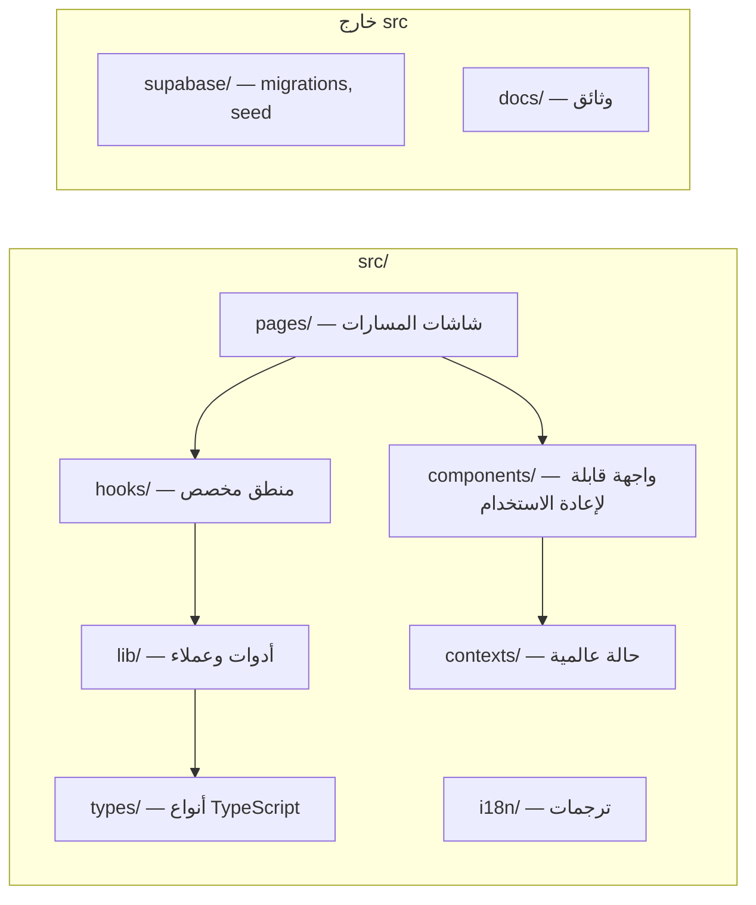

| المجلد               | المسؤولية                        | مثال                       |
| -------------------- | -------------------------------- | -------------------------- |
| `src/pages/`         | شاشة كاملة لكل مسار              | `ProjectsPage.tsx`         |
| `src/components/`    | قطع UI مشتركة                    | `PaginatedListPage.tsx`    |
| `src/components/ui/` | مكوّنات shadcn الأساسية          | `button.tsx`, `dialog.tsx` |
| `src/hooks/`         | منطق + ربط بـ Query/Mutation     | `useProjects.ts`           |
| `src/contexts/`      | مزودو السياق                     | `AuthContext.tsx`          |
| `src/lib/`           | دوال مساعدة، تحقق، عميل Supabase | `list-query.ts`            |
| `src/types/`         | أنواع DB والـ joins              | `database.ts`, `joins.ts`  |

**قاعدة ذهبية:** الصفحة (`page`) تنسّق؛ الـ hook يجلب البيانات؛ المكوّن يعرض.

### 3.2 Vite — أداة البناء

```typescript
// vite.config.ts
export default defineConfig({
  plugins: [react(), tailwindcss()],
  resolve: { alias: { '@': path.resolve(rootDir, './src') } },
  test: { environment: 'jsdom', setupFiles: ['./src/test/setup.ts'] },
})
```

**ما الذي يفعله Vite؟**

- **تطوير:** خادم سريع مع HMR (تحديث فوري عند الحفظ).
- **إنتاج:** تجميع وضغط عبر Rollup.
- **بيئات متعددة:** `--mode development|staging|production` يحمّل `.env.*` المناسب.

| البديل           | مقارنة سريعة                                  |
| ---------------- | --------------------------------------------- |
| Create React App | أبطأ، أقل نشاطاً في الصيانة                   |
| Next.js          | يضيف SSR/SSG — غير مطلوب لهذا SPA             |
| **Vite**         | سريع، بسيط، مثالي لـ SPA ← **اختيار المشروع** |

### 3.3 Tailwind CSS v4

تنسيق عبر **فئات CSS** في JSX:

```tsx
<Button className="w-full" disabled={!isConfigured || isSubmitting}>
```

**إمكانيات Tailwind (أوسع من الاستخدام الحالي):**

- Responsive: `sm:`, `md:`, `lg:`
- Dark mode: `dark:bg-background` (مع `next-themes`)
- RTL منطقي: `ps-4`, `text-start`, `end-4` بدل `left`/`right`
- `@apply` ومتغيرات CSS في `index.css`

---

## الحلقة 4: نقطة الدخول وشجرة المزودين

### 4.1 من HTML إلى React

```html
<!-- index.html -->
<div id="root"></div>
<script type="module" src="/src/main.tsx"></script>
```

```tsx
// src/main.tsx — يُركّب التطبيق في #root
createRoot(document.getElementById('root')!).render(
  <StrictMode>
    <QueryClientProvider client={queryClient}>
      <ThemeProvider attribute="class" defaultTheme="system" enableSystem>
        <LocaleProvider>
          <AppSettingsProvider>
            <AppErrorBoundaryProvider>
              <AuthProvider>
                <BrowserRouter>
                  <App />
                </BrowserRouter>
              </AuthProvider>
            </AppErrorBoundaryProvider>
            <Toaster />
          </AppSettingsProvider>
        </LocaleProvider>
      </ThemeProvider>
    </QueryClientProvider>
  </StrictMode>,
)
```

### 4.2 لماذا هذا الترتيب؟

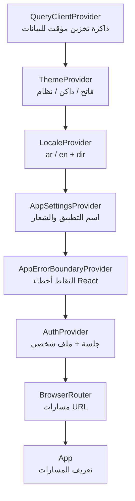

| المزود                | المكتبة        | لماذا خارج المكوّنات الفرعية؟      |
| --------------------- | -------------- | ---------------------------------- |
| `QueryClientProvider` | TanStack Query | كل الـ hooks تحتاج نفس الـ client  |
| `ThemeProvider`       | next-themes    | يضبط `class` على `<html>`          |
| `LocaleProvider`      | مخصص           | `t()` و `dir` في كل مكان           |
| `AuthProvider`        | مخصص           | الجلسة مطلوبة قبل المسارات المحمية |
| `BrowserRouter`       | React Router   | يستخدم سياق التوجيه                |

**قرار:** `Toaster` (إشعارات sonner) خارج `AuthProvider` ليظهر حتى في صفحة تسجيل الدخول.

### 4.3 إعدادات TanStack Query الافتراضية

```typescript
const queryClient = new QueryClient({
  defaultOptions: {
    queries: {
      staleTime: 60_000, // البيانات "طازجة" لدقيقة
      refetchOnWindowFocus: false, // لا إعادة جلب عند العودة للتبويب
    },
  },
})
```

**لماذا؟** تقليل طلبات الشبكة غير الضرورية في تطبيق إداري.

---

## الحلقة 5: التوجيه والحماية حسب الدور

### 5.1 React Router — المسارات المتداخلة

```tsx
// src/App.tsx
export default function App() {
  return (
    <Suspense fallback={<RouteFallback />}>
      <Routes>
        <Route path="/login" element={<LoginPage />} />
        <Route element={<ProtectedRoute />}>
          <Route element={<AppLayout />}>
            <Route index element={<DashboardPage />} />
            <Route element={<RoleRoute allowedRoles={[...]} />}>
              <Route path="projects" element={<ProjectsPage />} />
            </Route>
            <Route element={<RoleRoute allowedRoles={['company_director']} />}>
              <Route path="factories" element={<FactoriesPage />} />
            </Route>
          </Route>
        </Route>
        <Route path="*" element={<Navigate to="/" replace />} />
      </Routes>
    </Suspense>
  )
}
```

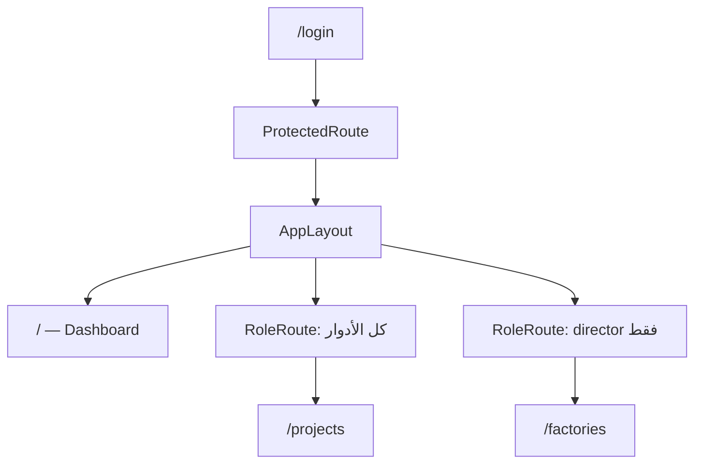

### 5.2 Lazy Loading — تقسيم الكود

```tsx
const ProjectsPage = lazy(() =>
  import('@/pages/ProjectsPage').then((module) => ({
    default: module.ProjectsPage,
  })),
)
```

**الفائدة:** كل صفحة تُحمَّل عند الحاجة — الحزمة الرئيسية أصغر وأسرع في التحميل الأول.

**إمكانيات React.lazy إضافية:**

- Preload: `const page = lazy(() => import(...))` + استدعاء عند hover على الرابط
- Suspense boundaries متعددة لكل قسم

### 5.3 ProtectedRoute — حماية المصادقة

```tsx
// src/components/auth/ProtectedRoute.tsx
export function ProtectedRoute() {
  const { session, profile, isLoading, isConfigured } = useAuth()

  if (!isConfigured) return <Navigate to="/login" replace />
  if (isLoading) return <div>{t('auth.loadingSession')}</div>
  if (!session || !profile?.is_active) return <Navigate to="/login" replace />

  return <Outlet /> // يعرض المسارات الفرعية
}
```

### 5.4 RoleRoute — حماية الصلاحيات

```tsx
// src/components/auth/RoleRoute.tsx
if (!profile || !allowedRoles.includes(profile.role)) {
  return <Navigate to="/" replace />
}
return <Outlet />
```

| الطبقة            | ماذا تحمي؟        | أين؟                                    |
| ----------------- | ----------------- | --------------------------------------- |
| RLS في PostgreSQL | البيانات الفعلية  | `supabase/migrations/`                  |
| RoleRoute         | إخفاء الشاشات     | `App.tsx`                               |
| دوال صلاحيات UI   | إظهار/إخفاء أزرار | `lib/project-status.ts`, `lib/roles.ts` |

> **مبدأ أمني:** إخفاء زر في الواجهة **لا يكفي** — RLS يمنع الوصول حتى لو عُرف endpoint.

---

## الحلقة 6: المصادقة والسياق (Context)

### 6.1 نمط Context API

```tsx
// src/contexts/AuthContext.tsx
const AuthContext = createContext<AuthContextValue | undefined>(undefined)

export function AuthProvider({ children }: { children: ReactNode }) {
  const [session, setSession] = useState<Session | null>(null)
  const [profile, setProfile] = useState<Profile | null>(null)
  // ...

  const value = useMemo(
    () => ({
      session,
      user: session?.user ?? null,
      profile,
      isLoading,
      signIn,
      signOut,
      refreshProfile,
    }),
    [session, profile, isLoading, signIn, signOut, refreshProfile],
  )

  return <AuthContext.Provider value={value}>{children}</AuthContext.Provider>
}

export function useAuth() {
  const context = useContext(AuthContext)
  if (!context) throw new Error('useAuth must be used within AuthProvider')
  return context
}
```

**لماذا `useMemo` للقيمة؟** لتجنب إعادة رسم كل المستهلكين عند كل render بدون تغيير فعلي.

### 6.2 عميل Supabase

```typescript
// src/lib/supabase.ts
export function isSupabaseConfigured(): boolean {
  return Boolean(supabaseUrl && supabasePublishableKey)
}

let client: SupabaseClient<Database> | undefined

export function getSupabase(): SupabaseClient<Database> {
  if (!client) client = createSupabaseClient()
  return client
}
```

**قرارات التصميم:**

- **Singleton lazy:** لا يُنشأ العميل إلا عند أول استخدام.
- **`isSupabaseConfigured`:** يسمح للتطبيق بالعمل وعرض رسالة واضحة بدون crash.
- **Typing بـ `Database`:** كل `.from('projects')` مُ typed.

### 6.3 مكتبة Supabase — إمكانيات أوسع

| الميزة         | الاستخدام في المشروع                      | إمكانيات إضافية           |
| -------------- | ----------------------------------------- | ------------------------- |
| Auth           | `signInWithPassword`, `onAuthStateChange` | OAuth, Magic Link, MFA    |
| Database       | `.from().select().insert()`               | RPC, filters معقدة, joins |
| Realtime       | `useProjectRealtime`                      | Presence, Broadcast       |
| Storage        | رفع مرفقات المشاريع                       | Policies على buckets      |
| Edge Functions | `manage-account`                          | منطق خادم آمن             |

### 6.4 التحقق من الحساب النشط

```typescript
async function assertActiveProfile(supabase, userId): Promise<Profile> {
  const profile = await fetchProfile(userId)
  if (!profile) {
    await supabase.auth.signOut()
    throw new AuthError('NO_PROFILE')
  }
  if (!profile.is_active) {
    await supabase.auth.signOut()
    throw new AuthError('INACTIVE_ACCOUNT')
  }
  return profile
}
```

**لماذا؟** الجلسة قد تكون صالحة في Auth لكن المستخدم مُعطَّل في `profiles` — يجب تسجيل خروج فوري.

---

## الحلقة 7: جلب البيانات وإدارة الحالة الخادمية

### 7.1 لماذا TanStack Query وليس useEffect فقط؟

```tsx
// src/hooks/useProjects.ts
export function useProjectsPage(params: ProjectsPageParams) {
  return useQuery({
    queryKey: queryKeys.projectsPage(params),
    queryFn: async () => {
      const supabase = getSupabase()
      let query = supabase
        .from('projects')
        .select(PROJECT_LIST_SELECT, { count: 'exact' })
        .order('created_at', { ascending: false })
      // فلاتر...
      return fetchPaginatedList<ProjectListItem>({
        page: params.page,
        pageSize: params.pageSize,
        query,
        mapItems: joinMappers.projectListItem,
      })
    },
  })
}
```

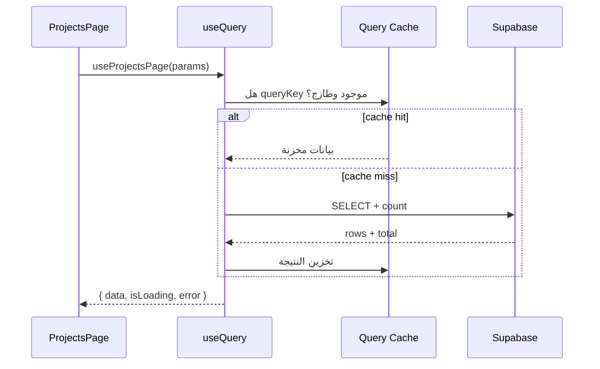

**إمكانيات TanStack Query (أوسع من الاستخدام الحالي):**

- `useInfiniteQuery` — تمرير لا نهائي
- `prefetchQuery` — تحميل مسبق عند hover
- `optimistic updates` — تحديث فوري قبل رد الخادم
- `placeholderData` — عرض بيانات سابقة أثناء التحديث
- Devtools للتصحيح

### 7.2 مفاتيح الاستعلام (Query Keys)

```typescript
// src/lib/query-keys.ts
export const queryKeys = {
  projects: ['projects'] as const,
  projectsPage: (params: ProjectsPageParams) =>
    ['projects', 'page', params] as const,
  project: (projectId: string | undefined) => ['project', projectId] as const,
}
```

**القاعدة:** المفتاح يجب أن يعكس **كل** ما يؤثر على النتيجة (صفحة، بحث، فلاتر).

### 7.3 الطفرات (Mutations) وإبطال الذاكرة

```typescript
export function useCreateProject() {
  const queryClient = useQueryClient()
  return useMutation({
    mutationFn: async ({ factoryId, userId, values, status }) => {
      const { data, error } = await supabase.from('projects').insert({...}).single()
      if (error) throw error
      return data
    },
    onSuccess: async () => {
      await queryClient.invalidateQueries({ queryKey: queryKeys.projects })
    },
  })
}
```

**لماذا `invalidateQueries`؟** بعد الإنشاء، القائمة المخزنة قديمة — إبطال يُجبر إعادة الجلب.

### 7.4 الترقيم (Pagination) العام

```typescript
// src/lib/list-query.ts
export async function fetchPaginatedList<T>({
  page,
  pageSize,
  query,
  mapItems,
}): Promise<PaginatedResult<T>> {
  const { from, to } = getPaginationRange(page, pageSize)
  const { data, error, count } = await query.range(from, to)
  if (error) throw error
  return {
    items: mapItems ? mapItems(data) : data,
    total: count ?? 0,
    page,
    pageSize,
  }
}
```

**قرار:** دالة عامة `fetchPaginatedList` بدل تكرار `.range()` في كل hook — **DRY**.

### 7.5 حالة القائمة في الواجهة

```typescript
// src/hooks/useListQueryState.ts
export function useListQueryState<T extends Record<string, string>>(
  initialFilters: T,
) {
  const [page, setPage] = useState(1)
  const [search, setSearchState] = useState('')
  const [debouncedSearch, setDebouncedSearch] = useState('')

  useEffect(() => {
    const timer = window.setTimeout(() => {
      setDebouncedSearch(search)
      setPage(1)
    }, 300)
    return () => window.clearTimeout(timer)
  }, [search])
  // ...
}
```

**لماذا debounce 300ms؟** لا نُرسل طلباً لكل حرف — ننتظر توقف الكتابة.

### 7.6 Joins و أنواع النتائج

```typescript
// src/types/joins.ts
export const PROJECT_LIST_SELECT = `
  *,
  factories (name, code),
  proposer:profiles!proposed_by (full_name),
  assigned_pm:profiles!assigned_pm_id (full_name)
` as const

export type ProjectListItem = Project & {
  factories: FactorySummary | null
  proposer: ProfileSummary | null
  assigned_pm: ProfileSummary | null
}
```

**قرار:** فصل أنواع الـ join عن `database.ts` — الملف الأول للجداول الخام، الثاني لاستعلامات العرض.

### 7.7 مكوّن القائمة المرقّمة

```tsx
// src/components/PaginatedListPage.tsx
export function PaginatedListPage<T>({ header, toolbar, items, query, children, ... }) {
  return (
    <section className="space-y-6">
      {header}
      {toolbar}
      <QueryState {...query}>
        <AdaptiveList items={items} renderMobileCard={...}>
          {children}  {/* جدول سطح المكتب */}
        </AdaptiveList>
        <ListPagination ... />
      </QueryState>
    </section>
  )
}
```

**نمط التصميم:** تخطيط موحّد لكل صفحات القوائم (مصانع، حسابات، مشاريع، تنبيهات).

---

## الحلقة 8: النماذج والتحقق

### 8.1 الثلاثي: React Hook Form + Zod + Resolver

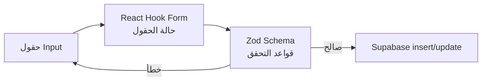

### 8.2 تعريف المخطط (Schema)

```typescript
// src/lib/validations/project.ts
export function createProjectFormSchema(t: ValidationTranslator) {
  return z
    .object({
      title: z.string().trim().min(3, t('validation.titleMin')),
      currency: z.string().trim().min(3).max(3),
      assigned_pm_id: z.string().uuid().nullable(),
    })
    .superRefine((values, ctx) => {
      if (values.budget) {
        const parsed = Number(values.budget)
        if (Number.isNaN(parsed) || parsed <= 0) {
          ctx.addIssue({
            code: 'custom',
            message: t('validation.budgetPositive'),
            path: ['budget'],
          })
        }
      }
    })
}

export type ProjectFormValues = z.infer<
  ReturnType<typeof createProjectFormSchema>
>
```

**لماذا `createXxxSchema(t)`؟** رسائل التحقق مترجمة (ar/en).

```typescript
// src/hooks/useValidationSchema.ts
export function useValidationSchema<TSchema extends z.ZodType>(
  factory: (t: ValidationTranslator) => TSchema,
): TSchema {
  const { t } = useTranslation()
  return useMemo(() => factory(t), [factory, t])
}
```

### 8.3 ربط النموذج في Dialog

```tsx
// src/components/factories/FactoryFormDialog.tsx
const { form, createSubmitHandler } = useFormDialog({
  open,
  resolver: zodResolver(factoryFormSchema),
  defaultValues: FACTORY_FORM_DEFAULTS,
  getValues: () => ({
    name: factory?.name ?? '',
    code: factory?.code ?? '',
    // ...
  }),
  resetDependencies: [factory],
})

const handleSubmit = createSubmitHandler(onSubmit, () => onOpenChange(false))
```

```typescript
// src/hooks/useFormDialog.ts — إعادة تعيين عند فتح الـ dialog
useEffect(() => {
  if (!open) return
  form.reset(getValues())
}, [form, open, ...resetDependencies])
```

### 8.4 تحويل القيم قبل الإرسال

```typescript
// src/lib/validations/project.ts
export function toProjectPayload(values: ProjectFormValues) {
  return {
    title: values.title,
    budget: values.budget?.trim() ? Number(values.budget.trim()) : null,
    currency: values.currency.toUpperCase(),
    // ...
  }
}
```

**فصل المسؤوليات:**

- `ProjectFormValues` — ما يراه المستخدم (نصوص)
- `toProjectPayload` — ما يتوقعه PostgreSQL (أرقام، null)

### 8.5 إمكانيات المكتبات

| المكتبة                 | في المشروع                             | يمكنك أيضاً                                   |
| ----------------------- | -------------------------------------- | --------------------------------------------- |
| **Zod**                 | `object`, `superRefine`, `z.infer`     | `discriminatedUnion`, `transform`, `pipe`     |
| **React Hook Form**     | `register`, `handleSubmit`, `useWatch` | `useFieldArray`, `Controller`, `FormProvider` |
| **@hookform/resolvers** | `zodResolver`                          | دعم Yup, Valibot, وغيرها                      |

---

## الحلقة 9: واجهة المستخدم والتصميم

### 9.1 shadcn/ui — مكوّنات قابلة للتملك

المكوّنات في `src/components/ui/` **ليست حزمة npm مغلقة** — كودك تنسخه وتعدّله.

```bash
npx shadcn add dialog   # إضافة مكوّن جديد
```

**مبني على Radix UI:** إمكانية وصول (a11y)، focus trap، keyboard navigation.

### 9.2 AppLayout — الهيكل العام

```tsx
// src/components/AppLayout.tsx — Sidebar + محتوى رئيسي
<SidebarProvider>
  <Sidebar side={dir === 'rtl' ? 'right' : 'left'}>
  <SidebarInset>
    <PageTransition>
      <Outlet />  {/* محتوى الصفحة الحالية */}
    </PageTransition>
  </SidebarInset>
</SidebarProvider>
```

**قرارات UX:**

- Sidebar قابل للطي (icon mode) على سطح المكتب
- Sheet drawer على الجوال
- `Ctrl/Cmd+B` لطي/فتح الشريط الجانبي

### 9.3 AdaptiveList — استجابة للشاشة

على الجوال: بطاقات. على سطح المكتب: جدول (`children`).

### 9.4 الحركة (Motion)

```tsx
// src/components/motion/PageTransition.tsx
// FadeIn, StaggerGroup — انتقالات خفيفة
```

**مبدأ:** حركة وظيفية لا زخرفية — تُوجّه الانتباه دون إبطاء.

### 9.5 next-themes

```tsx
<ThemeProvider attribute="class" defaultTheme="system" enableSystem>
```

يضيف/يزيل class `dark` على `<html>` — Tailwind يطبّق `dark:*` تلقائياً.

### 9.6 sonner — الإشعارات

```typescript
import { toast } from 'sonner'
toast.success(t('auth.signedInSuccess'))
toast.error(message)
```

**إمكانيات إضافية:** `toast.promise`, إجراءات مخصصة, ترتيب مكدس.

---

## الحلقة 10: الترجمة والاتجاه (RTL)

### 10.1 نظام i18n المخصص

```typescript
// src/contexts/LocaleContext.tsx
const t = useMemo(() => createTranslator(translations[locale]), [locale])

useLayoutEffect(() => {
  document.documentElement.lang = locale
  document.documentElement.dir = dir
}, [dir, locale])
```

### 10.2 Bootstrap مبكر في HTML

```html
<!-- index.html — يمنع وميض RTL خاطئ قبل تحميل React -->
<script>
  var stored = localStorage.getItem('pms-locale')
  var locale = stored === 'ar' || stored === 'en' ? stored : ...
  document.documentElement.dir = locale === 'ar' ? 'rtl' : 'ltr'
</script>
```

**لماذا مرتين؟** السكربت في HTML للومضة الأولى؛ `LocaleProvider` للتحديثات التفاعلية.

### 10.3 Tailwind المنطقي

| تجنّب          | استخدم             |
| -------------- | ------------------ |
| `ml-4`, `mr-4` | `ms-4`, `me-4`     |
| `text-left`    | `text-start`       |
| `left-4`       | `start-4`, `end-4` |

### 10.4 مفاتيح الترجمة

```typescript
// src/i18n/locales/ar.ts و en.ts
// استخدام: t('projects.title')
// مع معاملات: t('pagination.showing', { from, to, total })
```

**قرار:** ملفات TypeScript للترجمات (وليس JSON) — تحقق أنواع للمفاتيح.

---

## الحلقة 11: معالجة الأخطاء والتحديث الفوري

### 11.1 QueryState — حالات التحميل والخطأ

```tsx
// src/components/QueryState.tsx
if (isLoading) return <QueryStateSkeleton />
if (error) return <StatusMessage variant="error">...</StatusMessage>
return <div className="motion-fade-in">{children}</div>
```

### 11.2 Error Boundary

```tsx
// src/components/AppErrorBoundary.tsx — class component (مطلوب لـ Error Boundaries)
static getDerivedStateFromError() { return { hasError: true } }
componentDidCatch(error, errorInfo) { console.error(...) }
```

**الفرق:**

- `QueryState` → أخطاء **جلب بيانات** متوقعة
- `Error Boundary` → أخطاء **React render** غير متوقعة

### 11.3 أخطاء الطفرات

```typescript
// src/lib/mutation-error.ts
export function toastMutationError(error: unknown, fallbackMessage: string) {
  toast.error(getQueryErrorMessage(error, fallbackMessage))
}
```

### 11.4 Supabase Realtime

```typescript
// src/hooks/useRealtime.ts
const channel = supabase
  .channel(uniqueChannelName(`project-${projectId}`))
  .on(
    'postgres_changes',
    { event: '*', table: 'tasks', filter: `project_id=eq.${projectId}` },
    () =>
      queryClient.invalidateQueries({ queryKey: queryKeys.tasks(projectId) }),
  )
  .subscribe()

return () => {
  void supabase.removeChannel(channel)
}
```

**قرار:** `uniqueChannelName` بـ `crypto.randomUUID()` — تجنّب تعارض قنوات Realtime.

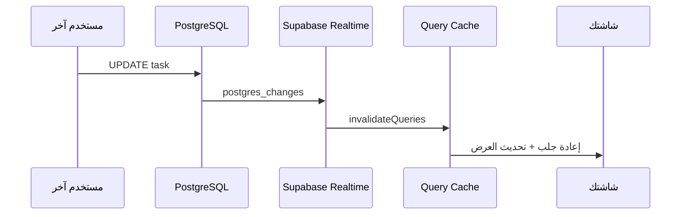

---

## الحلقة 12: إضافة ميزة جديدة من الصفر

### سيناريو تدريبي: إضافة صفحة "تقارير" للمدير

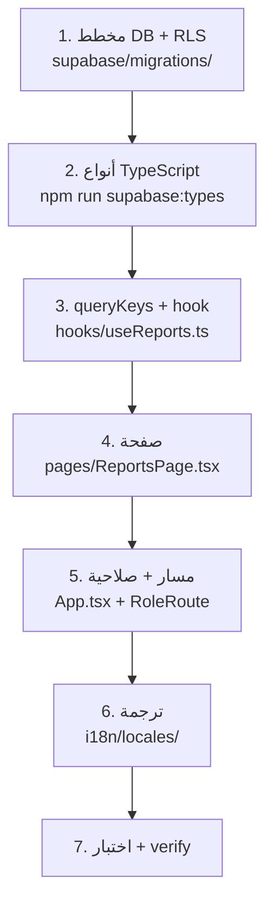

### الخطوات العملية

**1. قاعدة البيانات**

```sql
-- supabase/migrations/YYYYMMDD_reports.sql
CREATE TABLE reports (...);
ALTER TABLE reports ENABLE ROW LEVEL SECURITY;
CREATE POLICY ... ;
```

**2. أنواع**

```bash
npm run supabase:types
```

**3. Hook**

```typescript
// src/hooks/useReports.ts
export function useReportsPage(params: ReportsPageParams) {
  return useQuery({
    queryKey: queryKeys.reportsPage(params),
    queryFn: async () => fetchPaginatedList({ ... }),
  })
}
```

**4. صفحة** — انسخ نمط `FactoriesPage` أو `ProjectsPage`:

- `PageHeader`
- `PaginatedListPage`
- `ListToolbar`
- Dialog للإنشاء/التعديل

**5. مسار**

```tsx
const ReportsPage = lazy(() => import('@/pages/ReportsPage').then(m => ({ default: m.ReportsPage })))
// داخل RoleRoute للمدير
<Route path="reports" element={<ReportsPage />} />
```

**6. ترجمة** — أضف مفاتيح في `ar.ts` و `en.ts`.

**7. تحقق**

```bash
npm run verify && npm run test
```

### قائمة تحقق قبل الـ PR

- [ ] RLS مُفعَّل ومُختبر
- [ ] لا أسرار في الكود
- [ ] ترجمة ar + en
- [ ] حالات تحميل/خطأ/فارغ
- [ ] صلاحيات UI + مسار محمي
- [ ] `npm run verify` ناجح

---

## الحلقة 13: أفضل الممارسات وقرارات التصميم

### 13.1 مبادئ الكود النظيف في المشروع

| المبدأ             | تطبيق                             | مثال                                  |
| ------------------ | --------------------------------- | ------------------------------------- |
| **فصل المسؤوليات** | صفحة / hook / مكوّن               | `ProjectsPage` → `useProjectsPage`    |
| **DRY**            | دوال مشتركة                       | `fetchPaginatedList`, `useFormDialog` |
| **أنواع صريحة**    | لا `as any`                       | `ProjectListItem`, `z.infer`          |
| **أمان طبقات**     | RLS + RoleRoute + UI              | ثلاث طبقات                            |
| **i18n أولاً**     | لا نصوص صلبة                      | `t('key')`                            |
| **تجربة متسقة**    | `PaginatedListPage`, `QueryState` | كل القوائم                            |

### 13.2 قرارات معمارية ولماذا

| القرار               | البديل المرفوض       | السبب                      |
| -------------------- | -------------------- | -------------------------- |
| SPA + Supabase       | Next.js full-stack   | تعقيد أقل؛ RLS يكفي للأمان |
| TanStack Query       | Redux للبيانات       | مصمم لـ server state       |
| Context للـ Auth     | Redux/Zustand        | حالة بسيطة نسبياً          |
| Zod factories مع `t` | رسائل إنجليزية ثابتة | دعم عربي                   |
| Lazy routes          | استيراد مباشر        | حجم حزمة أصغر              |
| shadcn               | مكتبة UI مغلقة       | تخصيص كامل + a11y          |
| `fetchPaginatedList` | تكرار في كل hook     | صيانة أسهل                 |

### 13.3 ما لا يُفعل في هذا المشروع

- ❌ `as any`
- ❌ مفتاح service-role في الواجهة
- ❌ تجاوز RLS من المتصفح
- ❌ نصوص واجهة غير مترجمة
- ❌ `useEffect` لجلب بيانات بدون Query (إلا حالات خاصة)
- ❌ رفع SVG للشعار (خطر XSS — مُزال عمداً)

### 13.4 مسار التعلم المقترح بعد هذا الدليل

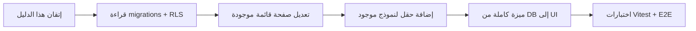

### 13.5 موارد داخل المشروع

| الملف                        | المحتوى               |
| ---------------------------- | --------------------- |
| `AGENTS.md`                  | أوامر وأدوات للمطورين |
| `memory-bank/`               | سياق المنتج والقرارات |
| `docs/staging-deployment.md` | نشر تجريبي            |
| `supabase/demo-accounts.md`  | حسابات تجريبية        |
| `.cursor/rules/`             | معايير الكود          |

---

## ملحق: خريطة تدفق تسجيل الدخول

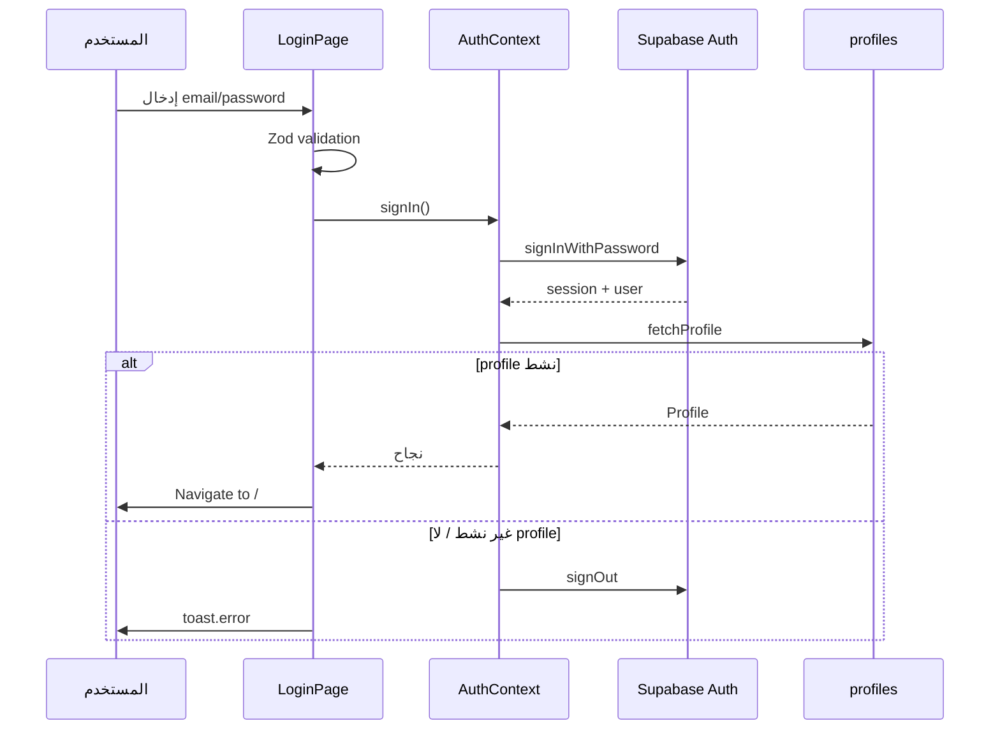

---

## ملحق: أدوار المستخدمين في التطبيق

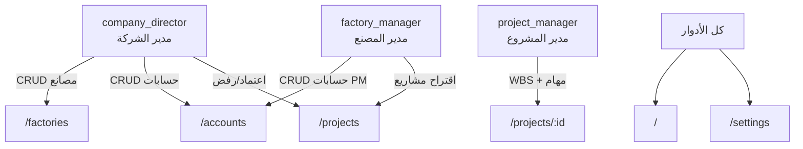

---

## خاتمة

هذا المشروع ليس مجرد واجهة — هو **نموذج عملي** لتطبيق React احترافي:

1. **TypeScript** للأمان
2. **React Router** للتنقل والصلاحيات
3. **Context** للحالة العالمية الخفيفة
4. **TanStack Query** لبيانات الخادم
5. **RHF + Zod** للنماذج
6. **Supabase + RLS** للخلفية
7. **i18n + RTL** لتجربة عربية كاملة

ابدأ بقراءة `main.tsx` → `App.tsx` → صفحة واحدة (`LoginPage` أو `ProjectsPage`) → الـ hook المرتبط. كرّر حتى تفهم كل طبقة. ثم طبّق [الحلقة 12](#الحلقة-12-إضافة-ميزة-جديدة-من-الصفر) على ميزة صغيرة.

> **تذكير:** التعلم التراكمي — لا تحاول فهم كل الملفات دفعة واحدة. كل حلقة في هذا الدليل = جلسة تركيز واحدة.

---

_آخر تحديث: يوليو 2026 — مبني على فرع `master` من Projects System Management._
